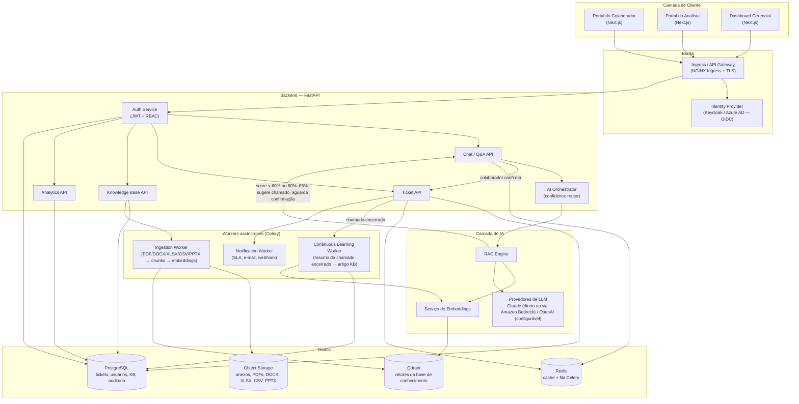
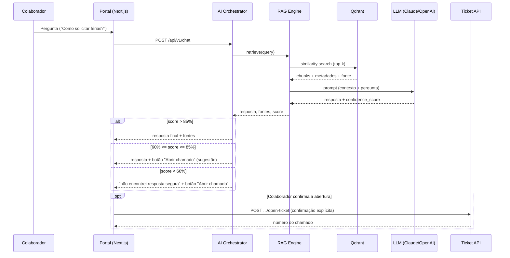
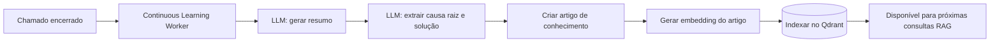

# Arquitetura — BEEP AI Service Desk

## 1. Objetivo

Plataforma de atendimento interno que resolve dúvidas de colaboradores via IA generativa
com RAG (Retrieval-Augmented Generation) sobre a base de conhecimento corporativa, e só
abre chamado humano quando a IA não tem confiança suficiente. Alvo: >10.000
solicitações/mês, com redução de ao menos 70% na abertura de chamados.

## 2. Diagrama de componentes



## 3. Fluxo de atendimento (confiança da resposta)



Em nenhum dos dois últimos ramos um chamado é criado sem a confirmação do
colaborador — a IA nunca abre um chamado sozinha, mesmo com confiança muito
baixa. Isso evita gerar um chamado a cada pergunta que a IA não sabe responder.

## 4. Aprendizado contínuo



## 4.1 Sincronização automática com pasta local/de rede

A base de conhecimento é mantida a partir de uma pasta local ou de rede
(montada no container/pod), sem reingestão manual e **sem nenhuma API
externa** — 100% local e sem custo. `sync_folder()`
(`app/services/local_folder_sync_service.py`) roda automaticamente no início
de toda resposta da IA (`chat_service.ask_question`), então a base reflete o
conteúdo mais recente da pasta antes de cada resposta.

```mermaid
flowchart LR
    A[Nova pergunta no chat] --> B[sync_folder]
    B --> C[Listar arquivos .txt/.pdf da pasta]
    C --> D{Arquivo novo, alterado ou já sincronizado?}
    D -->|Novo| E[Ler conteúdo do arquivo]
    D -->|mtime mais recente| E
    D -->|Sem mudança| F[Pular — só um stat(), sem custo de leitura/embedding]
    E --> G[ingest_document / reingest_document]
    G --> H[Gerar embeddings e indexar no Qdrant]
    F --> I[Responder a pergunta]
    H --> I
```

Detalhes:
- Sem credenciais, sem conta de serviço, sem chamada de rede a nenhum provedor —
  só leitura de arquivo (`Path.read_bytes()`).
- Formatos suportados: `.txt` e `.pdf`.
- Cada arquivo é rastreado pelo caminho relativo à pasta (`external_file_id`);
  a comparação de `mtime` (data de modificação do arquivo) evita reprocessar
  arquivos sem mudança — só um `stat()` por arquivo a cada pergunta, o custo de
  leitura/embedding só é pago por conteúdo de fato novo ou alterado.
- Reindexação usa ids de ponto determinísticos no Qdrant (UUID5 de
  `documento_id:índice_do_chunk`), então atualizar um arquivo sobrescreve seus
  vetores em vez de duplicá-los.
- Também pode ser disparada sob demanda via `POST /knowledge/documents/sync-local`
  (papel admin), sem precisar fazer uma pergunta no chat.
- Um erro em um arquivo (ex.: PDF corrompido) não interrompe a sincronização
  dos demais — fica registrado em `errors` no resultado.
- Uma falha na sincronização (ex.: pasta de rede temporariamente indisponível)
  não impede a IA de responder — ela só loga um aviso e segue com a base já
  indexada.

Passo a passo de configuração (montar a pasta de rede no container/pod,
variáveis de ambiente): `docs/LOCAL_KNOWLEDGE_SETUP.md`.

## 5. Camadas e responsabilidades

| Camada | Tecnologia | Responsabilidade |
|---|---|---|
| Frontend | Next.js 14, React 18, Tailwind | Portais (colaborador, chamados, analista), dashboard |
| API Gateway | NGINX Ingress | TLS, roteamento, rate limiting |
| Backend | FastAPI (Python 3.11) | Regras de negócio, orquestração de IA, REST API |
| Auth | Keycloak / Azure AD (OIDC) + JWT interno | SSO corporativo, RBAC |
| Banco relacional | PostgreSQL 16 | Tickets, usuários, KB, auditoria, configuração |
| Cache/Fila | Redis 7 | Cache de sessão/consultas, broker Celery |
| Vetorial | Qdrant | Embeddings de documentos, FAQs, artigos, chamados encerrados |
| Object storage | S3-compatible (MinIO em dev) | Anexos e documentos-fonte (PDF/DOCX/XLSX/CSV/PPTX) |
| Workers | Celery + Redis | Ingestão de documentos, aprendizado contínuo, notificações de SLA |
| Observabilidade | OpenTelemetry + Prometheus/Grafana + Loki | Métricas, tracing, logs centralizados |

## 6. Multi-tenant de departamentos (filas)

Cada fila é um `department` no banco, usado para roteamento de chamados e para
segmentar a base de conhecimento (RAG pode filtrar por `department_id` além do
top-k semântico). Filas: Folha de pagamento, Férias, Vale Refeição, Plano de saúde,
Vale transporte, Banco de horas, Admissão, Rescisão, Plano Odontológico, Seguro de
Vida, TotalPass, Gympass, Auxílio Creche, Declarações, Empréstimo Consignado,
Atualização Cadastral, Telemedicina Conexa, Ponto.

## 7. Segurança

- **SSO corporativo**: OIDC contra Keycloak (self-hosted) ou Azure AD (multi-tenant),
  configurável via `AUTH_PROVIDER`.
- **RBAC**: papéis `employee`, `analyst`, `department_lead`, `admin`, aplicados via
  dependência FastAPI (`require_role`) e refletidos no frontend (route guards).
- **JWT**: access token de curta duração (15 min) + refresh token httpOnly.
- **LGPD**: minimização de dados pessoais nos vetores (PII stripping antes de indexar),
  consentimento registrado, direito ao esquecimento (endpoint de exclusão em cascata).
- **Auditoria**: toda ação sensível (abrir/fechar/transferir chamado, acesso a dado
  pessoal, alteração de configuração de IA) grava em `audit_logs` com ator, IP, timestamp.
- **Logs**: estruturados (JSON), correlação por `request_id`, sem PII em texto livre.
- **Criptografia**: TLS em trânsito (ingress), AES-256 em repouso para anexos,
  hashing de segredos com `bcrypt`/KMS para chaves de API dos provedores de IA.

## 8. Escalabilidade (>10k solicitações/mês)

- Backend stateless, horizontal pod autoscaling (HPA) por CPU/latência.
- Cache de respostas de IA para perguntas frequentes (Redis, TTL configurável).
- Qdrant em modo cluster com réplicas de leitura.
- Filas assíncronas para ingestão pesada (não bloqueia requisição do usuário).
- Read replica de PostgreSQL para consultas do dashboard.
