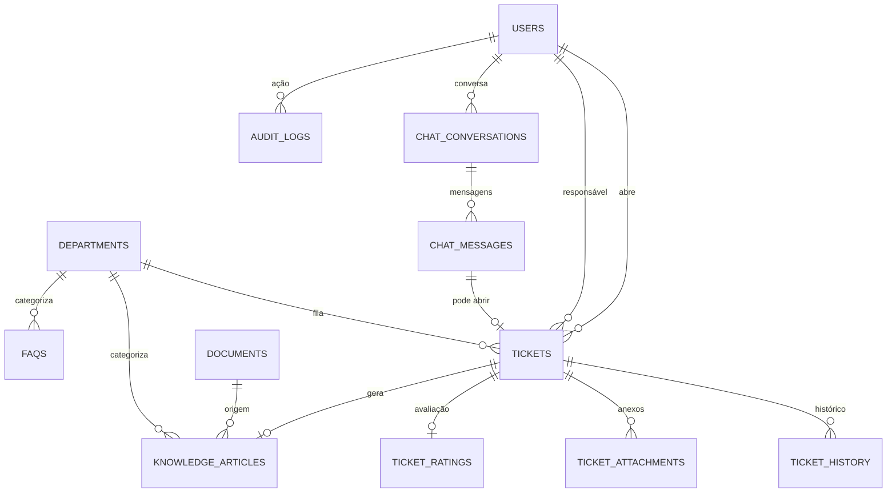

# Modelo de Dados — BEEP AI Service Desk

PostgreSQL 16. Todas as tabelas usam `id UUID` (default `gen_random_uuid()`),
`created_at`/`updated_at` com `TIMESTAMPTZ`. DDL completo em
`backend/alembic/versions/0001_initial_schema.py`.

## Diagrama entidade-relacionamento (resumo)

## Tabelas principais

### `users`
| Campo | Tipo | Descrição |
|---|---|---|
| id | UUID PK | |
| name | TEXT | |
| email | TEXT UNIQUE | |
| matricula | TEXT UNIQUE | matrícula do colaborador |
| department_id | UUID FK → departments | área do colaborador |
| role | ENUM(`employee`,`analyst`,`department_lead`,`admin`) | RBAC |
| identity_provider_sub | TEXT | `sub` do OIDC (Keycloak/Azure AD) |
| is_active | BOOLEAN | |
| created_at / updated_at | TIMESTAMPTZ | |

### `departments` (filas)
| Campo | Tipo | Descrição |
|---|---|---|
| id | UUID PK | |
| name | TEXT | Ex.: "Folha de pagamento", "Férias", "Ponto"... |
| slug | TEXT UNIQUE | |
| default_sla_hours | INT | SLA padrão da fila (em horas úteis) |
| default_priority | ENUM(`baixa`,`media`,`alta`,`critica`) | Prioridade aplicada quando o chamado (aberto pela IA ou manualmente) não especifica uma — reflete a importância do assunto, ex.: Folha de pagamento nasce `critica`, acesso ao Portal ADP (Ponto / Atualização Cadastral) nasce `baixa` |
| is_active | BOOLEAN | |

Seed inicial (`0002_seed_departments.py`): Folha de pagamento, Férias, Vale Refeição,
Plano de saúde, Vale transporte, Banco de horas, Admissão, Rescisão, Plano
Odontológico, Seguro de Vida, TotalPass, Gympass, Auxílio Creche, Declarações,
Empréstimo Consignado, Atualização Cadastral, Telemedicina Conexa, Ponto.
`default_priority` por fila definido em `0004_department_default_priority.py`.

### Cálculo de SLA em dias úteis

`sla_due_at` é calculado por `app/services/business_time.py` somando as horas de
SLA ao instante de abertura **pulando integralmente sábados, domingos e feriados
nacionais** (calculados em `app/services/br_holidays.py`, incluindo os móveis:
Carnaval, Sexta-feira Santa e Corpus Christi). Ou seja, um chamado crítico com
SLA de 4h aberto numa sexta às 23h só vence na segunda-feira.

### `tickets`
| Campo | Tipo | Descrição |
|---|---|---|
| id | UUID PK | |
| ticket_number | TEXT UNIQUE | gerado (`BEEP-000123`) |
| requester_id | UUID FK → users | solicitante |
| matricula | TEXT | denormalizado no momento da abertura |
| area | TEXT | área do solicitante (denormalizado) |
| department_id | UUID FK → departments | fila responsável |
| category / subcategory | TEXT | |
| priority | ENUM(`baixa`,`media`,`alta`,`critica`) | |
| status | ENUM(`novo`,`em_triagem`,`em_atendimento`,`aguardando_usuario`,`resolvido`,`encerrado`) | |
| sla_due_at | TIMESTAMPTZ | calculado por prioridade + fila |
| assigned_to | UUID FK → users NULLABLE | analista responsável |
| source | ENUM(`ia_automatico`,`ia_sugerido`,`manual`) | origem da abertura |
| origin_conversation_id | UUID FK → chat_conversations NULLABLE | |
| closure_reason | ENUM NULLABLE | `resolvido`, `sem_interatividade`, `duplicado`, `resolvido_pelo_colaborador`, `cancelado_pelo_colaborador`. Nulo enquanto aberto; **obrigatório no encerramento** |
| created_at / updated_at / closed_at | TIMESTAMPTZ | |

`closure_reason` é o que permite reportar quantos chamados foram de fato
resolvidos versus encerrados por falta de retorno do colaborador. Por isso
`PATCH /tickets/{id}/status` recusa `encerrado` (retorna `400`): encerrar só
acontece por `POST /tickets/{id}/close`, que exige o motivo. Sem essa guarda
haveria um caminho para fechar chamado sem motivo e o relatório ficaria furado.
O aprendizado contínuo (geração de artigo pela IA) só dispara em
`closure_reason = resolvido` — chamado morto por falta de retorno não tem
solução para ensinar à IA.

### `ticket_history`
`id, ticket_id FK, actor_id FK users NULLABLE, action, comment,
is_internal BOOLEAN default false, metadata JSONB, created_at`.
Ações: `criado`, `assumido`, `transferido`, `prioridade_alterada`, `comentario`,
`nota_interna`, `status_alterado`, `resolvido`, `encerrado`.

Esta tabela é ao mesmo tempo a trilha de auditoria e a **conversa** do chamado:
`comentario`/`nota_interna` são falas (renderizadas como mensagens na tela de
atendimento), o resto são eventos de fluxo (marcadores na timeline).

`is_internal = true` marca nota interna do time de atendimento — usada pelo
analista para registrar apuração ("conferir com a folha antes de responder")
sem expor isso a quem abriu o chamado. `GET /tickets/{id}` filtra essas linhas
quando quem consulta é o solicitante, e `POST /tickets/{id}/comments` ignora a
flag se o autor não for analyst+.

### `ticket_attachments`
`id, ticket_id FK, uploaded_by FK users, filename, content_type, storage_path, size_bytes, created_at`.

### `ticket_ratings`
`id, ticket_id FK UNIQUE, score SMALLINT (1-5), comment, created_at`.

### `knowledge_articles`
| Campo | Tipo | Descrição |
|---|---|---|
| id | UUID PK | |
| title / content | TEXT | |
| source_type | ENUM(`manual`,`faq`,`policy`,`generated`) | `generated` = aprendizado contínuo |
| department_id | UUID FK → departments NULLABLE | |
| tags | TEXT[] | |
| vector_id | TEXT | id do ponto no Qdrant |
| source_document_id | UUID FK → documents NULLABLE | |
| created_from_ticket_id | UUID FK → tickets NULLABLE | rastreabilidade do aprendizado contínuo |
| created_by | UUID FK → users NULLABLE | |
| created_at / updated_at | TIMESTAMPTZ | |

### `faqs`
`id, question, answer, department_id FK NULLABLE, vector_id, is_active, created_at`.

### `documents`
`id, filename, file_type ENUM(pdf,docx,xlsx,csv,pptx,txt), department_id FK NULLABLE,
storage_path, checksum, indexed_at NULLABLE, chunk_count, uploaded_by FK users NULLABLE,
source_provider ENUM(upload,local_folder) default upload, external_file_id UNIQUE NULLABLE,
external_modified_time NULLABLE, created_at`.

`uploaded_by` é nulo para documentos sincronizados automaticamente da pasta
local/de rede (`source_provider=local_folder`) — não há um usuário humano que
fez o upload. `external_file_id` (o caminho do arquivo relativo à pasta,
ex.: `beneficios/vale-refeicao.pdf`) identifica o documento entre
sincronizações para decidir se ele é novo, mudou (`external_modified_time` —
o `mtime` do arquivo — mais recente que o registrado) ou pode ser pulado sem
reprocessar.

### `chat_conversations`
`id, user_id FK, title, status ENUM(ativa,encerrada) default ativa, closed_at NULLABLE, created_at, updated_at`.

Encerrar uma conversa (`POST /chat/conversations/{id}/close`) é o que faz a IA
"esquecer" o histórico dela — mensagens de uma conversa `encerrada` não são
mais aceitas (`409`), e uma nova conversa não herda nenhuma memória da
anterior. A conversa encerrada continua consultável (histórico), só não
aceita novas mensagens.

### `chat_messages`
| Campo | Tipo | Descrição |
|---|---|---|
| id | UUID PK | |
| conversation_id | UUID FK | |
| role | ENUM(`user`,`assistant`,`system`) | |
| content | TEXT | |
| confidence_score | NUMERIC(5,2) NULLABLE | apenas para `assistant` |
| sources | JSONB | lista de fontes citadas (artigo/doc/faq + trecho) |
| resulted_ticket_id | UUID FK → tickets NULLABLE | quando a resposta gerou chamado |
| was_helpful | BOOLEAN NULLABLE | resposta ao "isso resolveu sua dúvida?", perguntado após toda resposta da IA. **Sem default de propósito**: `NULL` = ainda não respondeu, que é informação diferente de `false` = respondeu que não ajudou. Um `false` é o gatilho para oferecer o chamado ao DP |
| created_at | TIMESTAMPTZ | |

### `ai_settings`
`id, key UNIQUE, value JSONB, description, updated_by FK users, updated_at`.
Chaves: `confidence_threshold_auto` (0.85), `confidence_threshold_suggest` (0.60),
`default_llm_provider` (`anthropic`|`openai`), `default_llm_model`,
`rag_top_k`, `sla_by_priority`.

### `audit_logs`
`id, user_id FK NULLABLE, action, entity, entity_id, ip_address, metadata JSONB, created_at`.

## Índices relevantes

- `tickets(status, department_id)` — fila do analista.
- `tickets(requester_id, status)` — "meus chamados".
- `tickets(sla_due_at) WHERE status NOT IN ('resolvido','encerrado')` — monitor de SLA.
- `chat_messages(conversation_id, created_at)`.
- `knowledge_articles USING GIN (tags)`.
- `audit_logs(entity, entity_id)`.
